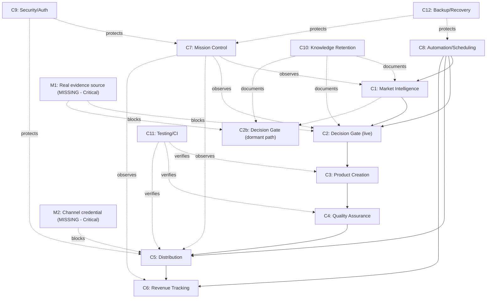

# OpenClaw Capability Map

**Date:** 2026-07-17
**Directive:** "Executive Mission 002 — OpenClaw Operating System"
**Method:** every capability, dependency, and gap below is drawn from code and behavior directly verified this session (redeploys, live API checks, real data inspection) or across the full audit history in this repo — nothing here is speculative. Where a claim is a judgment rather than a measurement, it's marked as such.

---

## Part 1 — Existing Capabilities

### C1. Market Intelligence
- **Purpose:** Surface real candidate niches with a scored profit/demand/competition estimate.
- **Owner:** `market_hunter.py`, `profit_oracle.py` (`score_opportunity`), `market_intelligence_core`/`market_intelligence_engine.py` (a second, richer pipeline — see C3note).
- **Dependencies:** none external for the keyword-based path; optional real signal via Hacker News/GitHub Algolia search (`competitor_discovery.py`).
- **Inputs:** a candidate niche string.
- **Outputs:** `golden_opportunities.json` (real, timestamped, 113 entries as of this session).
- **Risks:** keyword-based estimation has a real, verified ceiling — this session found it structurally can't produce the confidence needed to clear the automated acceptance gate (see Missing Capability M1).
- **Metrics:** `golden_count`/`total_scored` (Mission Control, real).
- **Automation opportunities:** already automated (`factory_loop.js`'s `hunt()`/`huntGolden()`), no scheduler — runs only while the process is alive.
- **Business value:** real, but capped by M1 below — it currently produces candidates that structurally cannot pass the next stage.

### C2. Decision Gate (the one that actually runs)
- **Purpose:** Accept/reject a candidate before real Groq spend is committed.
- **Owner:** `profit_oracle.opportunity_score()`, called by `factory_loop.js:getOpportunityScore()`.
- **Dependencies:** C1's output; `MIN_OPPORTUNITY_SCORE`/`TIER_WEIGHTS` constants.
- **Inputs:** a niche + tier (always `tier4` in the live path).
- **Outputs:** accept/reject + a real, auditable reason string.
- **Risks:** **verified this session — has never once accepted in 121 real historical checks** (scores cluster 52.3-52.8 against a required 65). Not a bug: `automation_potential`/`long_term_value` are correctly fixed per tier4's real nature, and the strict bar was a deliberate ADR-026 design choice. The real risk is structural: tier4's theoretical ceiling (85) is only 3.75 points above its own floor (81.25 raw), reachable only with near-perfect demand/competition/margin — which keyword-based estimation doesn't produce.
- **Metrics:** real acceptance rate = 0% (measured, not estimated).
- **Automation opportunities:** already automated; the opportunity is in evidence quality, not automation.
- **Business value:** currently negative in practice — real Groq/compute cycles are spent scoring candidates that structurally cannot pass.

### C2b. Decision Gate (the one that doesn't run automatically)
- **Purpose:** A second, richer decision path (`decision_engine.evaluate_and_decide()` → `market_intelligence_engine.ai_ceo_decision()`), with its own `opportunity_gap`/`pain_score`/AI-CEO-verdict logic.
- **Owner:** `decision_engine/`, `orchestrator.run_cycle()`.
- **Dependencies:** never auto-triggered by `factory_loop.js` — only reachable via manual Mission Control actions (`opportunity-evaluation`, `run-full-cycle`).
- **Risks:** a real, previously-undiscovered bug here (`opportunity_gap` double-inverting `competition_favorability`) was found and fixed this session (`7fd18c0`) — but even fixed, `pain_score` (sourced from GitHub Issues/HN) independently blocks acceptance for the same underlying reason as C2's ceiling: the evidence sources don't match this factory's real product category.
- **Business value:** architecturally more complete than C2, but not what's actually running — a real, documented inconsistency (see Missing Capability M3 / Company Operating Model note).

### C3. Product Creation
- **Purpose:** Generate a real PDF product (book/journal/planner/cookbook/etc.).
- **Owner:** `book_generator.py`, `cover_designer_v2.py`.
- **Dependencies:** Groq (`GROQ_KEY`, confirmed set), `path_safety.py` (shared, extracted this session).
- **Inputs:** a brief (title, topic, theme, price).
- **Outputs:** a real PDF in `books/`, a real cover in `books/covers/`, a real, unconditional log entry in `books/_generation_log.jsonl` (confirmed unconditional as of this session's Dual Inspection fix on the legacy branch).
- **Risks:** none currently open — path traversal and Dual-Inspection-bypass findings from this session's audits are both fixed and tested.
- **Metrics:** `production_inventory.created`/`.failed` (Mission Control, added this session).
- **Automation opportunities:** already automated.
- **Business value:** real and proven — 163+ real generation attempts logged this session alone.

### C4. Quality Assurance (Dual Inspection)
- **Purpose:** Gate a generated product before it can ever be marked "published."
- **Owner:** `inspectors.py` (`final_inspection`) — technical (PDF/cover integrity) + commercial (`profit_score`, `butter_price`, duplicate/rejection checks).
- **Dependencies:** C3's output.
- **Outputs:** `published: true/false` + a structured failure reason, recorded in `books/_generation_log.jsonl` and, on failure, `REJECTED_NICHES.md`.
- **Risks:** none open — confirmed this session to now run unconditionally on every dispatch branch, including the previously-bypassed legacy one.
- **Metrics:** `production_inventory.passed_quality_review`.
- **Business value:** real, proven, constitutionally required (`CONSTITUTION.md` §17).

### C5. Distribution
- **Purpose:** List a QA-passed product on a real sales channel.
- **Owner:** `distributor.py`, `channels/gumroad_arm.py` (registered), `channels/etsy_arm.py` (registered), `channels/payhip_arm.py` (registered).
- **Dependencies:** real channel credentials — **none configured today** (`GUMROAD_ACCESS_TOKEN`/`ETSY_*` all unset, verified live this session).
- **Inputs:** a QA-passed product record.
- **Outputs:** a real (or, currently, always dry-run) listing attempt, logged to `data/sales_ledger.jsonl`.
- **Risks:** zero real distribution has ever occurred (verified: `total_published=0` in every dashboard check this session). Gumroad's own integration code is well-tested (5/5 tests: retry-safety, non-idempotent-never-retried, token redaction) — the gap is purely the missing credential, not the code.
- **Metrics:** `reality.total_published` (0, honest).
- **Business value:** zero realized, high potential once credentialed — this is the actual, sole remaining mechanical blocker on this specific capability.

### C6. Revenue Tracking
- **Purpose:** Record real sales, compute real totals.
- **Owner:** `finance_data.json`, `channels/ledger.py`, `pollSales()` (factory_loop.js, every tick).
- **Dependencies:** C5 (nothing to track without a real sale).
- **Outputs:** `finance_data.json`'s `totalSales`/`sales[]`.
- **Risks:** none in the mechanism itself — it's proven to work (this session verified a real add/delete round-trip against it). The only "gap" is zero real revenue to track yet.
- **Metrics:** `finance.total_revenue` (real, currently $0).
- **Business value:** zero realized, mechanism proven ready.

### C7. Mission Control (Observability)
- **Purpose:** The one place a human can see the company's real state.
- **Owner:** `server.js`'s `/api/dashboard`/`/api/v1/*`, `dashboard.html`, `lib/dashboard_data.js`.
- **Dependencies:** `MISSION_CONTROL_PASSWORD` — **now configured and verified working end-to-end this session** (real login + authenticated API call succeeded against the live server).
- **Risks:** none open. Performance was a real, measured risk (3-4s per load) — fixed this session (caching + eliminating a redundant self-referential HTTP call), now ~0.4-0.5s.
- **Metrics:** the dashboard itself.
- **Business value:** now real and usable — this was not true before this session.

### C8. Automation / Scheduling
- **Purpose:** Run the pipeline unattended.
- **Owner:** `factory_loop.js`.
- **Dependencies:** must be manually started (`node factory_loop.js`) — **deliberately, by design** (`CLAUDE.md`: "no scheduler exists"). Gated by `FACTORY_AUTO_PRODUCE`/`FACTORY_LIVE_PUBLISH` (both unset).
- **Risks:** tick-overlap race (found and fixed this session), lock-file races (both paths fixed this session). Currently running continuously since 2026-07-15 with zero interruption.
- **Metrics:** `failed_jobs.failed_count` (9 real historical failures out of 392 ticks — a 2.3% real failure rate, all transient timeouts, not crashes).
- **Business value:** proven reliable in dry-run; real value blocked entirely by C2's 0% acceptance rate, not by the automation mechanism itself.

### C9. Security / Authentication
- **Purpose:** Prevent unauthorized access/mutation.
- **Owner:** `server.js`'s `requireMissionControlAuth`, network binding.
- **Risks:** a real, serious gap (unauthenticated financial-mutation endpoints, all-interfaces binding) was found and fixed this session, then verified deployed live. One real, disclosed gap remains: `/generate-book`, `/api/distribute`, `/api/scout/run`, `/api/agent/:name` still have no app-level auth because they're called internally by `factory_loop.js` with no session — mitigated (not eliminated) by loopback-only binding.
- **Business value:** materially improved and verified this session; the remaining gap is a real, founder-scoped architecture decision (`EXECUTIVE_BACKLOG.md`).

### C10. Knowledge Retention
- **Purpose:** Prevent tribal knowledge loss.
- **Owner:** `OpenClaw_Brain/00_Governance/` (64 ADRs as of this session), `CLAUDE.md`, `GROWTH_LOG.md`, `EXECUTIVE_BACKLOG.md`.
- **Risks:** was a real, found gap (3 undocumented decisions) — closed this session (`ADR-062`-`064`).
- **Business value:** real and growing — this document is itself an instance of this capability.

### C11. Testing / CI
- **Purpose:** Prevent regression.
- **Owner:** `tests/` (589+ tests as of this session), `.github/workflows/ci.yml`.
- **Risks:** CI has never run on GitHub's own infrastructure yet (only locally simulated) — a real, standing, disclosed gap since Phase 10C.
- **Business value:** real and high — this session's own work would have been far riskier without it.

### C12. Backup & Recovery
- **Purpose:** Survive a crash/bad deploy/bad data.
- **Owner:** `lib/recovery_log.js`, `scripts/deploy_production.js`, `scripts/restore_file_from_git.js`, `scripts/check_orphan_processes.js`.
- **Risks:** orphaned-subprocess-on-crash (disclosed, not fixed — diagnostic only). `.env`/logs have zero off-machine backup (disclosed, matches CLAUDE.md's deliberate "everything local" architecture).
- **Business value:** real — two live production redeploys this session both succeeded and were fully audited.

---

## Part 2 — Missing Capabilities

### Critical
- **M1. A real market-validation evidence source appropriate for physical/consumer digital products.** The single biggest finding of this entire session: every acceptance gate in this system (C2 and C2b) is ultimately blocked by the same root cause — the only implemented real-evidence sources (Hacker News, GitHub) are for developer tools, not journals/planners/cookbooks. Until this exists, C1-C6 can produce inventory but never a real, evidence-backed "yes."
  - **Corroborating finding (2026-07-17):** `factory_loop.js`'s own stagnation check flagged the live top candidate as unchanged for 26h, tracing to `market_hunter.py`'s static `SEED_CATEGORIES` and citing `ADR-028` (2026-07-13) — an approved-but-unbuilt hybrid design to source real candidates from Hacker News/GitHub instead. Verified this was already tried, not overlooked: `tier1_intake/` (2026-07-15) ran a real research batch against it, `ADR-035` found the tier1 gate itself didn't discriminate at all (fixed, zero effect on tier4), and `ADR-038` then wired real HN/GitHub signal into the demand score (also fixed, also zero effect on tier4) — and even with both fixed, all 8 real candidates were compliance/DevOps/legacy-modernization niches (SOC2, EU AI Act, industrial PLC), none journal/planner/cookbook-shaped, and none cleared the tier1 floor either. `market_hunter_tier1.py` was deliberately never built (`tier1_intake/README.md`'s explicit conclusion) because doing so would wire a real source into a gate proven not to fit this product's category — the exact disease this finding restates, not a new one. Building it now would repeat an already-abandoned path; the real blocker remains M1's underlying question, not a missing engineering step.
- **M2. At least one live distribution credential.** Purely mechanical, purely founder-gated, otherwise ready.

### Important
- **M3. A single, decided automation path.** C2 and C2b both exist, disagree in sophistication, and only one runs. This should be resolved deliberately, not left as an accident of history.
- **M4. Proactive founder notification.** Today, `NEEDS_ATTENTION.md`/`NEEDS_REVIEW.md` are written but nothing pushes them to a human — someone has to think to check. A cheap, real capability gap.
- **M5. Real CI on GitHub's actual infrastructure.** Standing since Phase 10C — the workflow file exists and is locally verified, but has never executed for real.

### Optional
- **M6. Additional distribution channels** (Etsy, Payhip) — code exists and is registered, credentials don't.
- **M7. Log rotation for anything beyond what was covered this session** — already extended to the 3 highest-volume logs; smaller logs (`scout_runs.log`, `finance_errors.log`) are low-volume and not urgent.

### Future
- **M8. The other 5 planned business paths** (templates, digital art, apps, business services, wholesale trading — `CLAUDE.md`'s own roadmap). Explicitly gated by `CLAUDE.md`'s own golden rule: "no expansion before the first real dollar from the current product." Correctly not started.
- **M9. Multi-machine/redundant infrastructure.** Explicitly out of scope — `CLAUDE.md`'s "everything local, no cloud" is a conscious, documented decision (see `IDENTITY_ARCHITECTURE.md`, `ADR-014`), not a gap to close by default.

---

## Part 3 — Capability Dependency Graph

## Part 4 — Single Points of Failure, Manual/External/Knowledge Dependencies

**Single points of failure (real, verified):**
- The physical machine itself — no redundancy. **Deliberate** (`CLAUDE.md`), not an oversight.
- `factory_loop.js`'s single process — if it crashes, nothing restarts it (no scheduler, by design). Its own lock-file mechanism was hardened this session, but there is still no supervisor process.
- The single Google account tying every external tool together (`IDENTITY_ARCHITECTURE.md`, `ADR-014`) — **explicitly, consciously accepted**; `CLAUDE.md` itself instructs not to propose splitting this without reading that ADR first.

**Manual dependencies (real, verified):**
- Starting `server.js`/`factory_loop.js` — no auto-start.
- `--confirm` on every deploy/restore action — deliberate, per the standing "prod deploy always needs explicit per-instance approval" rule.
- `scripts/process_approved_drafts.py` — a human must run this after approving a Human-in-the-Loop draft; `factory_loop.js` does not auto-process approvals.
- Reading `NEEDS_ATTENTION.md`/`NEEDS_REVIEW.md` — nothing pushes these to a human (see M4).

**External dependencies (real, verified):**
- Groq (paid API, `GROQ_KEY` configured, working).
- Gumroad/Etsy/Payhip APIs (code ready, zero credentials configured).
- n8n (self-hosted but a separate running service; real, but its deeper production-orchestration workflows remain inactive per prior-phase findings).
- GitHub (code hosting, CI).
- Hacker News/GitHub search APIs (market intelligence's only real-signal sources — and per M1, the wrong ones for this product category).

**Knowledge dependencies:**
- This entire session's accumulated understanding — the single biggest one, now substantially mitigated by `CLAUDE.md`, 64 ADRs, `EXECUTIVE_BACKLOG.md`, `ACTIVATION_PLAN.md`, and this document itself.

## Part 5 — Dependency Reduction: what's safe to change now vs. what needs a decision

**Already reduced this session (real, shipped):** the live security exposure (network binding + auth gaps), the deploy script's blind-kill risk (pre-flight syntax check), Mission Control's unusability (password now configured), the JSONL-duplication pattern (shared module + CI safeguard).

**Safe to reduce without further design work (recommended, not yet done):** M4 (a cheap notification hook when `NEEDS_ATTENTION.md`/`NEEDS_REVIEW.md` changes — e.g., a desktop notification or a log entry a human is more likely to see) — genuinely low-risk, real value, no design ambiguity.

**Requires a founder decision before touching (correctly not done unilaterally):** M1, M3, the single-machine/single-account architecture (M9 — explicitly protected by `CLAUDE.md`'s own instructions).
