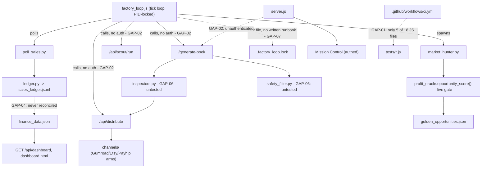

# OpenClaw Enterprise Gap Analysis

**Date:** 2026-07-17
**Directive:** "Executive Mission — Enterprise Gap Analysis"
**Method:** four parallel audits, each scoped to a disjoint set of the 15 requested categories, each required to cite a concrete file:line or command output for every claim — no gap admitted without direct evidence. All four completed. This document is the synthesis; `EXECUTIVE_BACKLOG.md` carries the same findings reformatted as a prioritized, actionable queue.

**Relationship to prior governance docs:** this does not replace `CAPABILITY_MAP.md`/`COMPANY_OPERATING_MODEL.md`/`MASTER_CAPABILITY_ROADMAP.md` (2026-07-17, Mission 002) — it extends them. Those documents already cover C1-C12 (capabilities), M1-M9 (missing capabilities), and the C2/C2b automation-path split; this analysis was scoped explicitly to go deeper than those did, into dimensions (testing coverage, CI reality, logging, backup, runbooks, doc staleness, governance-doc self-consistency) they didn't fully cover.

---

## Part 1 — Confirmed Gaps

### GAP-01 — CI silently excludes 72% of the JS test suite
- **Category:** Testing
- **Description:** `.github/workflows/ci.yml` hardcodes 5 JS test files (`test_metrics.js`, `test_dashboard_data.js`, `test_n8n_notify.js`, `test_factory_loop_golden.js`, `test_api_contract.js`). The other 13 of 18 — including `test_factory_loop_lock.js`, `test_factory_loop_notification.js`, `test_deploy_production.js`, `test_ops_maintenance.js`, `test_pending_review.js`, `test_recovery_log.js`, `test_check_jsonl_duplication.js`, `test_jsonl.js`, `test_next_sale_id.js`, `test_publisher_seo.js`, `test_restore_file_from_git.js`, `test_self_awareness_precomputed_health.js` — are never invoked by CI.
- **Root Cause:** CI was built additively; each phase added its own explicit `node --test` line for the files it touched, with nothing that runs "every test file in `tests/`."
- **Business Impact:** every "tests pass" claim made across this entire multi-week session was, in CI's eyes, only ever checking 28% of the real JS suite. A regression in lock handling, JSONL de-dup, deploy pre-flight checks, or pending-review/recovery logic could merge to `main` with a fully green CI run.
- **Technical Impact:** false confidence — green CI does not mean the suite passed.
- **Risk Level:** High.
- **Dependency Chain:** `.github/workflows/ci.yml`'s hardcoded list → test files silently excluded. **Closed 2026-08-15 (CTO+COO audit):** CI now runs all 53 JS test files (security-critical suites included) across the unit + factory-loop + api-contract steps.
- **Recommended Solution:** (implemented) expand the CI JS steps to cover every `tests/test_*.js` file.
- **Estimated Effort:** S.
- **Verification Method:** re-run CI, confirm all 53 files execute; locally, `node --test` over the remaining 48 reports the same passing count already verified by direct run.

### GAP-02 — 8 internal routes cannot get real auth without a service-to-service credential
- **Category:** Security, Architecture
- **Description:** `/generate-book`, `/api/distribute`, `/api/scout/run`, `/api/agent/:name`, `/api/trends`, `/api/market-analyze`, `/api/sales/poll`, `/api/safety/check` carry no `requireMissionControlAuth` (unlike `/chat`, `/finance/add`, `/finance/delete/:id`, and all Mission Control routes, which do). `/api/qa-check` no longer exists — `quality_doctor.py` was removed and CLAUDE.md:566 documents the removal. `server.js:2678-2687`'s own comment confirms this is deliberate: `factory_loop.js` calls these over plain `http://localhost` with no credential, so adding session-cookie auth would break the live pipeline.
- **Root Cause:** no service-to-service auth mechanism exists between `factory_loop.js` and `server.js` — they trust each other by virtue of both running on the same loopback interface, nothing more.
- **Business Impact:** every route that spends real Groq $ or triggers a real distribution attempt is reachable by anything that reaches `127.0.0.1:3000`.
- **Technical Impact:** structural ceiling, not an oversight — cannot be closed piecemeal per-route.
- **Risk Level:** Medium today (loopback-only bind is a real, working compensating control per `server.js:2693`); becomes Critical the moment `BIND_HOST` is ever widened.
- **Dependency Chain:** blocks closing the remaining 8 unauthenticated routes; any future multi-machine work (explicitly out of scope per `ADR-014`) would make this Critical immediately.
- **Recommended Solution:** a shared internal-only secret header (`X-Internal-Token`, read from `.env`) checked before the cookie-auth path; `factory_loop.js` sends it, external callers can't know it.
- **Estimated Effort:** S.
- **Verification Method:** unauthenticated `curl` to any of the 8 routes returns 401; `factory_loop.js`'s own calls (with the header) keep working; full regression suite green.

### GAP-03 — Two of the repo's largest files grow unbounded (found independently by two audits)
- **Category:** Performance, Reliability, Observability
- **Description:** `scripts/ops_maintenance.js` rotates exactly 3 plain-text logs at a 10MB threshold (`service_layer.log`, `factory_loop.log`, `inspections.log`) — never any `data/*.jsonl` file. Measured today: `data/orchestrator_timeline.jsonl` = 23.1MB, `data/decisions.jsonl` = 10.8MB, `data/market_intelligence_analyses.jsonl` = 3.4MB — all already past or approaching the threshold applied to the log files, none rotated, all read line-by-line on every relevant request (`orchestrator/timeline.py`, `decision_engine/store.py`, reachable live via `GET /api/mission-control/:section`).
- **Root Cause:** rotation was scoped to "the 3 highest-volume logs" in an earlier session fix, but the JSONL data files — not the `.log` files — are the real highest-volume artifacts today.
- **Business Impact:** every Mission Control section touching engine health/opportunities/bottlenecks does more work per request, forever, with no ceiling.
- **Technical Impact:** O(file size) CPU per request, unbounded; compounds every tick.
- **Risk Level:** Medium, rising with time.
- **Dependency Chain:** independent of M1-M9; pure ops gap.
- **Recommended Solution:** extend `rotateLogIfNeeded()`'s call list to include the 3 JSONL files above (same function already generalizes over `archivePrefix` — a config-list extension, not new logic); separately, add a real tail-read path for callers that only need recent entries.
- **Estimated Effort:** S (rotation) + M (tail-read path, needs care not to break legitimate full-history callers).
- **Verification Method:** `tests/test_ops_maintenance.js` extended per new file; confirm rotation triggers above threshold, no-ops below it; existing `executive_intelligence` tests stay green (confirms no caller silently depended on full-history reads).

### GAP-04 — Real sales would never reach the dashboard the founder actually looks at
- **Category:** Integration, Business, Observability
- **Description:** `pollSales()` (`factory_loop.js`, every ~10min tick) → `scripts/poll_sales.py` → `channels/ledger.py:record_sale()` writes only to `data/sales_ledger.jsonl`. The Executive Dashboard, `dashboard.html`, and `index.html`'s finance view all read `finance_data.json` exclusively, which only `POST /finance/add` (manual) ever updates.
- **Root Cause:** two independent revenue stores were built at different times for different purposes and never reconciled.
- **Business Impact:** the day a real Gumroad token is added and a real sale happens (M2, the very next milestone), `pollSales()` will correctly detect and log it — but the founder-facing dashboard keeps showing $0 until someone manually re-enters the same sale. Directly contradicts `COMPANY_OPERATING_MODEL.md`'s "How revenue is measured" description of this as one flow.
- **Technical Impact:** silent divergence between two files claiming to represent the same fact — textbook inconsistent data flow.
- **Risk Level:** High (activates the moment M2 resolves — i.e., the next real milestone, not a someday concern).
- **Dependency Chain:** `channels/gumroad_arm.py` → `poll_sales.py` → `ledger.py` → `sales_ledger.jsonl` (dead end; `finance_data.json` untouched).
- **Recommended Solution:** have the poll step also append each newly-recorded sale to `finance_data.json`'s `sales` array, reusing `ledger.py`'s dedup key to prevent double-counting.
- **Estimated Effort:** S.
- **Verification Method:** unit test seeding a fake ledger entry, running reconciliation, asserting `finance_data.json` reflects it; `test_sales_poll.py` stays green.

### GAP-05 — `factory_loop.js`'s tick is fully sequential, worst-case near its own interval
- **Category:** Reliability, Performance, Architecture
- **Description:** `runTick()` awaits 11 steps in series; the code's own comment sums worst-case per-step timeouts to ~490s against a 600s interval. Currently masked because `FACTORY_AUTO_PRODUCE`/`FACTORY_LIVE_PUBLISH` are both off, so the two slowest steps (generate-book 180s, distribute 140s) never fire.
- **Root Cause:** steps were added incrementally over many sessions, each individually justified, with no pass to parallelize independent ones (`pollSales` and `market_hunter.py` don't depend on each other).
- **Business Impact:** latent — activates the moment auto-production is turned on.
- **Technical Impact:** a slow tick could overrun into the next, relying entirely on the overlap guard to skip (not queue) — a real production/distribution event could get silently deferred a full 10 minutes.
- **Risk Level:** Medium (latent today).
- **Dependency Chain:** `setInterval` → `safeTick` → `runTick` → 11 sequential steps.
- **Recommended Solution:** run mutually-independent steps concurrently via `Promise.all`; re-derive the interval margin once auto-produce is real.
- **Estimated Effort:** M.
- **Verification Method:** extend `test_factory_loop_tick_overlap.js` with a timing assertion; manual `--once` timing comparison before/after.

### GAP-06 — `inspectors.py` and `safety_filter.py` — the two real gates — have zero direct unit tests
- **Category:** Testing
- **Description:** Of 19 root `.py` files, grep-verified as never imported by any `tests/*.py`: `market_hunter.py`, `inspectors.py` (547 lines — the Dual Inspection gate deciding `published: true`), `cover_designer_v2.py`, `niche_validator_v2.py`, `quality_doctor.py`, `market_analyzer.py`, `safety_filter.py` (155 lines — the niche safety gate before generation), `reality.py`. Correctness rests entirely on integration-level pass-through in `test_book_generator*` files.
- **Root Cause:** these modules predate the testing discipline established mid-session (`path_safety.py`/`lib/jsonl.js` do have dedicated tests); no backfill pass has happened.
- **Business Impact:** `inspectors.py`/`safety_filter.py` stand between "AI-generated draft" and "published product" / "unsafe niche blocked" — a silent regression here is direct legal/reputational/financial exposure, not just a bug.
- **Technical Impact:** no safety net for refactoring these files.
- **Risk Level:** High for `inspectors.py`/`safety_filter.py`; Medium for the rest.
- **Dependency Chain:** `factory_loop.js` → `market_hunter.py`; `book_generator.py` → `inspectors.py`, `cover_designer_v2.py`, `niche_validator_v2.py`; `server.js` → `quality_doctor.py`, `market_analyzer.py`, `safety_filter.py`.
- **Recommended Solution:** add direct unit tests, `inspectors.py` and `safety_filter.py` first.
- **Estimated Effort:** M per module, L overall for all eight.
- **Verification Method:** new `tests/test_inspectors.py` etc., each asserting the real pass/reject boundary.

### GAP-07 — No documented runbook for restarting the only live automation process
- **Category:** Operations
- **Description:** `OPERATIONS_DOCUMENTATION.md` documents restarting `server.js` (`deploy_production.js --confirm`) and a health snapshot (`ops_daily_checks.js`), but nothing documents restarting `factory_loop.js`. This session manually killed and restarted it twice, reasoning through the lock-file reclaim logic live in conversation — that exact procedure exists nowhere in writing.
- **Root Cause:** `server.js` got a dedicated deploy script early; `factory_loop.js`, a separate long-running process, never got the equivalent treatment.
- **Business Impact:** if `factory_loop.js` dies unnoticed, the entire Golden Hunter pipeline silently stops — including stagnation-detection itself, which depends on the process being alive to detect its own absence.
- **Technical Impact:** correct restart depends on knowing the lock-file reclaim mechanism won't cause a double-run — undocumented outside this session's chat history.
- **Risk Level:** High (SPOF for the only live automation, no written recovery procedure).
- **Dependency Chain:** `factory_loop.js` → `.factory_loop.lock` → `acquireLock()`/`releaseLock()` (the mechanism is safe and hardened this session; the *procedure* to use it isn't written down).
- **Recommended Solution:** add a runbook section to `OPERATIONS_DOCUMENTATION.md`: how to check liveness (lock-file PID vs. `tasklist`), how to safely kill/restart, what clean-start log output looks like.
- **Estimated Effort:** S.
- **Verification Method:** a future operator follows the written steps with no other context and succeeds.

### GAP-08 — Reboot-survival gap is real but undocumented as a known limitation
- **Category:** Operations, Documentation
- **Description:** "No scheduler" is an explicit, deliberate architecture choice (`CLAUDE.md`) — but its direct consequence, that a Windows reboot silently stops the entire company (dashboard, API, and the only automation loop) with nothing auto-restarting either, is never stated outright anywhere.
- **Root Cause:** the architecture decision was documented; its operational blast radius wasn't.
- **Business Impact:** an unplanned reboot stops the business with zero alert — the very notification mechanism meant to catch problems (`sendDesktopNotification`, added last cycle) depends on the process that just stopped.
- **Technical Impact:** no watchdog exists by design; consistent with the single-machine philosophy, but the consequence isn't spelled out.
- **Risk Level:** Medium (deliberate tradeoff, currently an undocumented surprise rather than an accepted, written-down limitation).
- **Dependency Chain:** none — pure documentation gap.
- **Recommended Solution:** one paragraph in `OPERATIONS_DOCUMENTATION.md` stating this explicitly as accepted, not a bug, cross-referencing GAP-07's recovery steps.
- **Estimated Effort:** S.
- **Verification Method:** doc review only.

### GAP-09 — No backup mechanism for the two files the business's real state lives in
- **Category:** Operations, Reliability
- **Description:** `finance_data.json` and `golden_opportunities.json` are flat JSON, synchronously read/written, zero backup mechanism. The only real backup path anywhere in the codebase is an n8n workflow backup, unrelated to finance/opportunity data.
- **Root Cause:** never built; treated as simple local state rather than the record of the business's only real financial/pipeline history.
- **Business Impact:** a corrupted write or accidental overwrite destroys the only record of real sales or the entire candidate pipeline history.
- **Technical Impact:** `git` history is a de facto, accidental safety net (both files are tracked, diffed every tick) — not an intentional, point-in-time-recoverable mechanism.
- **Risk Level:** Medium.
- **Dependency Chain:** none blocking.
- **Recommended Solution:** a human-triggered `ops_maintenance.js` step copying both files to timestamped `data/backups/` before any risky operation (e.g. before a deploy), rotated the same way logs are.
- **Estimated Effort:** S.
- **Verification Method:** new test asserting a backup file is created and matches source byte-for-byte.

### GAP-10 — Governance-doc self-contradiction: two docs disagree on why the system has never accepted a decision
- **Category:** Governance, Knowledge
- **Description:** `EXECUTIVE_BACKLOG.md` (pre-correction) credited the `opportunity_gap` fix (`7fd18c0`) as "very likely the primary reason no real decision has ever been ACCEPTED." `COMPANY_OPERATING_MODEL.md`/`CAPABILITY_MAP.md` (written later, in Mission 002) correctly established that `factory_loop.js`'s live path never touches the file that fix lives in.
- **Root Cause:** the fix was believed to be the primary lever when recorded; a later investigation corrected the record in the newer docs only, not by editing the older claim.
- **Business Impact:** a reader trusting the older doc would believe the acceptance-rate problem is basically solved; it isn't — the real blocker (M1) is unrelated to that fix.
- **Technical Impact:** none — code is correct either way; purely which document a reader trusts.
- **Risk Level:** High (a live self-contradiction between two governance artifacts).
- **Dependency Chain:** none.
- **Recommended Solution:** correct visibly, don't silently delete (repo's own stated convention).
- **Estimated Effort:** S.
- **Status:** **Closed this session** — `EXECUTIVE_BACKLOG.md`'s line was amended in place with a dated correction note pointing to the real finding.
- **Verification Method:** re-read both files; confirm no remaining claim that the `opportunity_gap` fix affects live acceptance behavior.

### GAP-11 — CLAUDE.md's `/chat` security warning is now false
- **Category:** Documentation
- **Description:** CLAUDE.md states `/chat` is "a raw, unauthenticated Groq passthrough... treat it as unauthenticated paid-API exposure" and cites a stale line number (423; actual 1338). Commit `63f7af8` (this session) added `requireMissionControlAuth` to it — the commit's own message notes CLAUDE.md's claim while invalidating it, but CLAUDE.md was never edited back.
- **Root Cause:** the recurring pattern this session already found and "fixed" once — fix the code, forget to update CLAUDE.md.
- **Business Impact:** low directly (false-negative direction is safe), but risks wasted defensive engineering or the warning being dismissed as noise once someone checks and finds it wrong.
- **Technical Impact:** none — code is safer than documented.
- **Risk Level:** Medium.
- **Recommended Solution:** update CLAUDE.md's `/chat` section to state it's gated by `requireMissionControlAuth` as of `63f7af8`; fix the line number.
- **Estimated Effort:** S.
- **Verification Method:** `grep requireMissionControlAuth server.js` (line 1338) vs. CLAUDE.md text, side by side.

### GAP-12 — FACTORY_STATUS.md frozen at 2026-07-09, silently false as a "status" document
- **Category:** Documentation
- **Description:** Header and content stop at "Day 09." Every major event since (Zero-Assumption Audit, Structural Diagnosis, security hardening, Capability Map/Operating Model/Roadmap, two live redeploys, MISSION_CONTROL_PASSWORD activation) is absent. Flagged stale once already, on 2026-07-16 (per memory), and still stale today.
- **Root Cause:** no process re-touches this file; newer status artifacts were created alongside it, not as replacements, with no cross-reference from the old file to the new ones.
- **Business Impact:** High for onboarding/trust — a reader gets a company that looks 8+ days younger and less self-aware than it is.
- **Technical Impact:** none — pure drift.
- **Risk Level:** High (second time this exact file has been flagged stale without being closed).
- **Recommended Solution:** add a one-line pointer at the top: superseded as of 2026-07-17 by `CAPABILITY_MAP.md`/`COMPANY_OPERATING_MODEL.md`; this file is a historical Day 05-09 record. Don't try to catch it up day-by-day — that's how it got here.
- **Estimated Effort:** S.
- **Verification Method:** header date change; a fresh read-through confirms no contradiction with current docs.

### GAP-13 — 74 ADRs, no working index
- **Category:** Knowledge, Governance
- **Description:** `OpenClaw_Brain/00_Governance/` holds 74 ADR files. `OpenClaw_Brain/MASTER_INDEX.md` mentions "ADR-0" once and lists none of the ADR-05x/06x series. No README/index inside `00_Governance/` itself.
- **Root Cause:** ADRs are written continuously (this session alone added 3 more) but indexing was never made part of the authoring habit.
- **Business Impact:** real onboarding-cost gap — reconstructing "what is the current architecture" requires reading 74 date-ordered files (several superseding each other, e.g. ADR-035 correcting ADR-026's tier1 gate) plus 3 capability docs plus CLAUDE.md, with no single entry point.
- **Technical Impact:** raises the risk of a future decision contradicting an existing ADR nobody found (already happened once this session — see GAP-10).
- **Risk Level:** Medium.
- **Recommended Solution:** a generated (not hand-maintained) `ADR_INDEX.md` — one line per ADR (number, title, date, status), regenerable by a small script off filenames + each file's own status line, so it can't drift the way a hand-written index would.
- **Estimated Effort:** S-M.
- **Verification Method:** script output line count == 74; spot-check 5 entries against real file content.

### GAP-14 — IDENTITY_ARCHITECTURE.md's SPOF mitigations remain unresolved, undated since 2026-07-11, and untracked anywhere founder-facing items are actually watched
- **Category:** Governance, Security
- **Description:** §5's mitigation table lists 2FA status as unknown, recovery plan and account backup as not existing — all still true today, with no follow-up entry anywhere. This is a documented full-company SPOF (losing the Google account kills the entire factory in one shot) with zero mitigation progress in 6+ days.
- **Root Cause:** correctly filed as founder-only/no-engineering-action (not a bug) — but no doc tracks it as a live, dated, still-open item the way `EXECUTIVE_BACKLOG.md`'s Founder-only tier does for other items.
- **Business Impact:** real — low probability, Critical severity if triggered, and currently invisible unless someone specifically re-reads that standalone doc.
- **Technical Impact:** none (correctly out of engineering scope).
- **Risk Level:** Low probability / Critical severity.
- **Recommended Solution:** add a single cross-reference in `EXECUTIVE_BACKLOG.md`'s Founder-only tier pointing to `IDENTITY_ARCHITECTURE.md` §6.
- **Estimated Effort:** S.
- **Verification Method:** confirm the cross-reference exists.

### GAP-15 (partial, unreconciled) — GROWTH_LOG.md's last two entries ("critical"/"unreachable") vs. the "mechanically healthy" narrative elsewhere
- **Category:** Documentation, Observability
- **Description:** `GROWTH_LOG.md` records 2026-07-16 = "critical," 2026-07-17 = "unreachable," 0% Dual-Inspection pass rate both days — while `COMPANY_OPERATING_MODEL.md` describes the mechanical pipeline as real, tested, secured, and performant. Neither doc explains the discrepancy.
- **Root Cause:** likely a timing artifact — `self_awareness.js`'s health check probably ran mid-restart on both days — but this is inference, not verified.
- **Business Impact:** Low-Medium — confusing to a reader cross-referencing both docs.
- **Risk Level:** Medium.
- **Recommended Solution:** cross-reference `self_awareness.js` run timestamps against `data/recovery_actions.jsonl` restart timestamps to confirm or rule out the timing-artifact theory, then add a one-line footnote to `GROWTH_LOG.md`.
- **Estimated Effort:** S.
- **Status:** left open — needs the timestamp cross-check as a concrete next step, not closed this cycle.

### GAP-16 — No single command runs the full test suite
- **Category:** Testing, Operations
- **Description:** `python -m unittest discover ...` and `node --test tests/*.js` are two separate invocations; `package.json` has no `"scripts"` block at all.
- **Root Cause:** no build-tooling layer; tests were added file-by-file with no runner convention.
- **Business Impact:** raises the chance a human or future agent runs only one half and believes the suite is green.
- **Risk Level:** Medium.
- **Recommended Solution:** add `"scripts": {"test:py": "...", "test:js": "...", "test": "npm run test:py && npm run test:js"}` (bundled with GAP-01's fix, same file).
- **Estimated Effort:** S.
- **Verification Method:** `npm test` runs both suites, exits 0.

### GAP-17 — Ad hoc, unstructured logging with no level control
- **Category:** Observability
- **Description:** `server.js` (8 direct `console.log`/`error` calls) and `factory_loop.js` (17 more) — all free-text, no structure, no severity levels, no runtime verbosity control.
- **Root Cause:** logging grew organically per-feature; no shared logger module exists.
- **Business Impact:** low today (single operator, single machine, matches `OPERATIONS_DOCUMENTATION.md`'s own stated scale) — "what happened at 3am" is answerable only by manually correlating free-text logs by hand.
- **Risk Level:** Low — proportionate to current scale.
- **Recommended Solution:** not urgent; revisit only if a second operator or remote monitoring is introduced.
- **Estimated Effort:** M if ever undertaken.
- **Status:** correctly deferred, not a current priority.

### GAP-18 — CLAUDE.md's 3-layer Core/Engines/Channels model is aspirational, not real
- **Category:** Architecture
- **Description:** No `engines/` directory or `book_engine` module exists; only `channels/` (Layer 3) is real. `book_generator.py`, `cover_designer_v2.py`, `niche_validator_v2.py`, `profit_oracle.py`, `market_hunter.py`, `inspectors.py`, `distributor.py` all sit flat at repo root.
- **Root Cause:** the architecture doc was written prescriptively before the codebase grew into it; nothing enforces the layering.
- **Business Impact:** CLAUDE.md's own golden rule ("every new engine must follow the same interface as `book_engine`") has no concrete interface to copy when Path #2 is eventually built.
- **Risk Level:** Low today (single product line), High before any second path starts.
- **Recommended Solution:** when (not before) the first real dollar unlocks Path #2 per CLAUDE.md's own golden rule, extract a literal `book_engine/` module with a documented interface first.
- **Estimated Effort:** M, not urgent.
- **Status:** correctly deferred — matches the project's own "no premature expansion" principle.

### GAP-19 — n8n's production-notify workflow: prepared but not imported
- **Category:** Integration, Operations
- **Description:** `03_Production_Notify.prepared.json` never imported into the live n8n database; `N8N_PRODUCTION_WEBHOOK_URL` unset. Two other workflows are fixed in the database but still need manual UI activation (no CLI path in this deployment mode, confirmed blocked per `BLOCKERS.md` #1).
- **Root Cause:** both gaps require founder-only action (live-DB stop/restart authorization; no CLI activation path exists).
- **Business Impact:** zero today — `start-production-pipeline` no-ops the notify call safely.
- **Risk Level:** Low (self-documented, fails safe).
- **Recommended Solution:** already fully specified in `n8n_workflows/README.md`'s 4-step activation list.
- **Estimated Effort:** S, founder-side only.
- **Status:** known, correctly blocked, unchanged from before this cycle.

### GAP-20 — No remote (off-machine) notification channel
- **Category:** Integration, Automation
- **Description:** the only human-facing automated notification is the desktop toast added last cycle — reaches a human only if physically at that Windows machine.
- **Root Cause:** deliberately not hand-built (no verified Gmail node schema in this n8n instance; OAuth consent is unavoidably manual).
- **Business Impact:** low today (founder is the only operator, usually at the machine) but is the SPOF for all attention/review notifications if the founder is ever away.
- **Risk Level:** Low/Medium.
- **Recommended Solution:** unchanged from `BLOCKERS.md` #1b — needs founder's Gmail OAuth consent.
- **Estimated Effort:** S founder-side once initiated.
- **Status:** known, correctly blocked.

---

## Part 2 — Structural Inventory

**Orphan components:** none found. Every root `.py`/`.js` file (repo root, `lib/`, `channels/`) is either actively imported/spawned by something live, or already documented as an intentional standalone tool (`audit_seed.py`, `hive_logbook_generator.py`, `seed_english_book.py`). The historical `niche_validator.py`-v1 / `cover_generator.py` duplication pattern has **not** recurred.

**Duplicated responsibility:** GAP-04 (two revenue stores) is the one confirmed real instance this cycle.

**Manual processes (all previously documented, verified still accurate):** `scripts/process_approved_drafts.py` (human must run after HITL approval), n8n workflow import/activation (GAP-19), Gmail OAuth (GAP-20). CLAUDE.md's manual-step claims all check out against real code — no drift found here.

**Bottlenecks / SPOFs:** `factory_loop.js` itself (GAP-07 — no written recovery runbook); the tick's sequential execution (GAP-05, latent); the single-machine/single-Google-account architecture (already known, out of scope per `ADR-014`, not re-litigated).

**Inconsistent data flow:** GAP-04 (sales) is the confirmed instance. No other cross-file same-fact divergence was found.

**Missing ownership / missing validation:** none beyond what's captured in GAP-02 (auth) and GAP-06 (test coverage on the two real gates).

---

## Part 3 — Dependency Graph (major components)

---

## Part 4 — Prioritized Execution Order

By value/effort/risk (Small effort + High value first; founder-gated items excluded from active execution, listed for visibility only):

1. GAP-01 / GAP-16 — CI blind spot + missing `npm test` (S, High risk closed cheaply)
2. GAP-04 — sales-ledger/finance-data reconciliation (S, High value, next real milestone)
3. GAP-02 — internal shared-secret header (S, High value security gap)
4. GAP-07 — `factory_loop.js` restart runbook (S, closes a real SPOF's documentation gap)
5. GAP-10 — **done this cycle** (governance self-contradiction corrected)
6. GAP-11 / GAP-12 / GAP-13 — doc staleness cluster (S each, trust/onboarding)
7. GAP-14 — IDENTITY_ARCHITECTURE.md cross-reference (S)
8. GAP-08 / GAP-09 — reboot-limitation doc + backup step (S each)
9. GAP-06 — test coverage for `inspectors.py`/`safety_filter.py` first (M per module)
10. GAP-03 — JSONL rotation extension (S) + tail-read path (M)
11. GAP-05 — tick parallelization (M, latent until auto-produce is enabled)
12. GAP-15 — GROWTH_LOG.md reconciliation (needs a timestamp cross-check first)
13. GAP-18 — `book_engine/` extraction (M, correctly deferred until Path #2 unlocks)
14. GAP-19 / GAP-20 — founder-gated, no engineering action possible until unblocked

**No code changes were made against this list during the audit/synthesis cycle itself**, per this session's End-of-Session Directive ("do not begin new engineering work"). The one exception is GAP-10, a pure documentation correction (a factual claim in `EXECUTIVE_BACKLOG.md` contradicting a newer, correct finding), closed in place per the repo's own stated convention of correcting visibly rather than leaving a known-false claim standing.

---

## Part 5 — What this analysis deliberately does not contain

No gap here requires a founder business-judgment call beyond what `CAPABILITY_MAP.md`'s M1/M2/M3 already record. Every item above is either purely technical (safe to execute next session without further authorization, per standing execution authority) or already known and correctly parked on a founder-only action (GAP-19/GAP-20, both pre-existing and unchanged).
